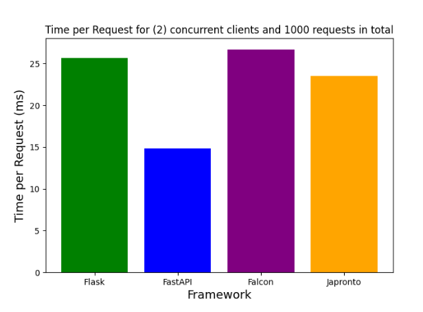
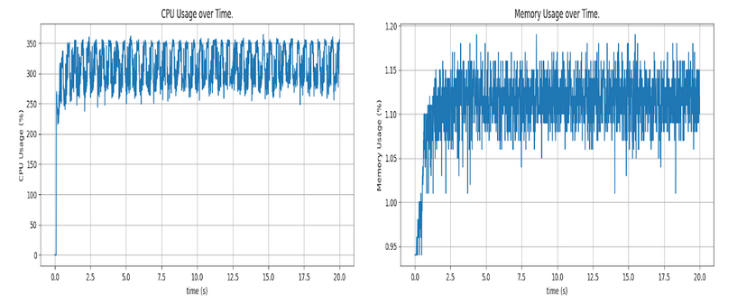

# Optimización del Evaluator en el sistema de Log Detector

## Introduccion a la Computacion Paralela

La idea del proyecto consiste en optimizar el rendimiento del “Evaluador” (También referido como “Evaluator”) dentro del sistema de Log Detector. El sistema de Log Detector se conforma por un conjunto de microservicios, que trabajan juntos para ofrecer al usuario la funcionalidad de reconocer patrones en archivos de registro (También referidos como “Logs”). Dentro de éste sistema el Evaluador cumple un rol crítico, que de fallar o tener un pobre rendimiento, afectaría el funcionamiento de todo el sistema.

## How to run it?

##### (1) Activate virtual env.

    pipenv install -r requirements && pipenv shell

##### (2) Run the evaluator instance(s). The _stress.py_ script is set to send request to the 4 different instances of the evaluator, each implementing a different web framework (flask, falcon, fastapi, japronto). In case you have Docker installed, you can use

    docker-compose --file evaluator/logdetector-evaluators.yml up

If not, manually run the instances. Disclaimer, this way is less reliable as problem with dependencies could appear. Run each line on a different terminal:

    pipenv run python3 evaluator/app_flask.py
    pipenv run python3 evaluator/app_falcon.py
    pipenv run python3 evaluator/app_fastapi.py
    pipenv run python3 evaluator/app_japronto.py # This won't work as its harder to install

##### (3) Stress the evaluator service.

    pipenv run python3 stress.py

This will prompt you into the scenario selection. Enter a 0 to select the scenario 0.
This will test the 4 evaluator instances using the current settings in _settings_scenarios.py_
The test consists in sending POST HTTP request to the /eval route and measure the elapsed time per request.
Output should look like this:

```
(proyecto-Xx0NZDcT) $ python3 stress.py 
EVALUATOR URLS: [('http://localhost:5000', 'flask'), ('http://localhost:6000', 'falcon'), ('http://localhost:7000', 'fastapi'), ('http://localhost:8000', 'japronto')]

Which scenario do you want to run?
[0] eval multiple frameworks
[1] eval variable gunicorn workers

[4] exit
0
 == TEST SETTINGS ==
LOGS: [1000]
CLIENTS: [2, 4, 5, 10, 20]

Running Test #1 | 2022-08-05T19:11:36
url: http://localhost:5000/eval
clients: 2
logs: 1000
client 0 will send 500 requests to http://localhost:5000/eval
client 1 will send 500 requests to http://localhost:5000/eval
Elapsed: 25252.83 ms
Single Log Time Average: 25.253 ms
```
And in the evaluator app should report the requests:
```
logdetector-evaluator-flask_1     | 172.18.0.1 - - [05/Aug/2022:19:09:17 +0000] "POST /eval HTTP/1.1" 200 77 "-" "python-requests/2.27.1"
logdetector-evaluator-flask_1     | 172.18.0.1 - - [05/Aug/2022:19:09:17 +0000] "POST /eval HTTP/1.1" 200 77 "-" "python-requests/2.27.1"
logdetector-evaluator-flask_1     | 172.18.0.1 - - [05/Aug/2022:19:09:17 +0000] "POST /eval HTTP/1.1" 200 77 "-" "python-requests/2.27.1"
logdetector-evaluator-flask_1     | 172.18.0.1 - - [05/Aug/2022:19:09:17 +0000] "POST /eval HTTP/1.1" 200 77 "-" "python-requests/2.27.1"
logdetector-evaluator-flask_1     | 172.18.0.1 - - [05/Aug/2022:19:09:17 +0000] "POST /eval HTTP/1.1" 200 77 "-" "python-requests/2.27.1"
logdetector-evaluator-flask_1     | 172.18.0.1 - - [05/Aug/2022:19:09:17 +0000] "POST /eval HTTP/1.1" 200 77 "-" "python-requests/2.27.1"
```
Results of the test will be writen in a .csv file into the results/ folder.
Results can be plotted with:
    
    python3 bar_plotter.py
    

  
##### (4) Optional if you are using docker, you can monitor the use of resources done by a evaluator instance.

    docker_stats_fetcher/docker_stats_fetcher.sh <container_id>

Results are written into a .json file to the docker_stats_fetcher/ folder.
They can be plotted using:

    pipenv run python3 graph_maker.py -f <input_file> -s <start_date> -e <end_date>
    


##### (5) Test the FastAPI evaluator with variable amount of gunicorn workers. *This test requires Docker*.

    pipenv run python3 stress.py
    
And enter a 1 to active the scenario. Then the a 2 to select the FastAPI framework. The script will send requests to the evaluator in the docker container and automatically increase/reduce the amount of gunicorn workers.

## Deprecated/Old stuff

##### (1) Previously 3D graphics like:


Could be done with _3d_plotter.py_. This problably won't work anymore as the _stress.py_ changed.

##### (2) The pypy3.8-v7.3.9-linux64/ contains the pypy binaries used for the test with pypy flask.

##### (3) evaluator/Dockerfile_support is the dockerfile used to bring up a container to help test the multiples replica (horizontal scaling) test.
